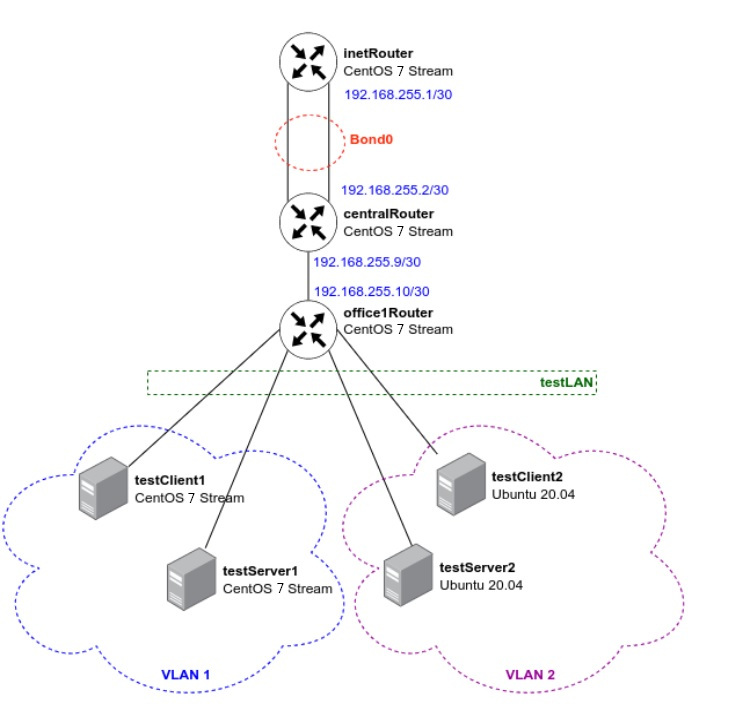

#	VLAN'ы,LACP

Задание:

в Office1 в тестовой подсети появляется сервера с доп интерфесами и адресами
в internal сети testLAN: 
- testClient1 - 10.10.10.254
- testClient2 - 10.10.10.254
- testServer1- 10.10.10.1 
- testServer2- 10.10.10.1

Равести вланами:
testClient1 <-> testServer1
testClient2 <-> testServer2

Между centralRouter и inetRouter "пробросить" 2 линка (общая inernal сеть) и объединить их в бонд, проверить работу c отключением интерфейсов


Выполнение:

Итоговая топология



Разворачиваем настроенную топологию через vagrant+ansible, проверяем настройки и доступность:

#### Client1
```
[vagrant@testClient1 ~]$ ip a | grep 10.10.10
    inet 10.10.10.254/24 brd 10.10.10.255 scope global noprefixroute eth1.1
```

```
[vagrant@testClient1 ~]$ ping 10.10.10.254
PING 10.10.10.254 (10.10.10.254) 56(84) bytes of data.
64 bytes from 10.10.10.254: icmp_seq=1 ttl=64 time=0.032 ms
64 bytes from 10.10.10.254: icmp_seq=2 ttl=64 time=0.023 ms
64 bytes from 10.10.10.254: icmp_seq=3 ttl=64 time=0.039 ms
64 bytes from 10.10.10.254: icmp_seq=4 ttl=64 time=0.021 ms
64 bytes from 10.10.10.254: icmp_seq=5 ttl=64 time=0.024 ms
64 bytes from 10.10.10.254: icmp_seq=6 ttl=64 time=0.026 ms
64 bytes from 10.10.10.254: icmp_seq=7 ttl=64 time=0.026 ms
64 bytes from 10.10.10.254: icmp_seq=8 ttl=64 time=0.027 ms
^C
--- 10.10.10.254 ping statistics ---
8 packets transmitted, 8 received, 0% packet loss, time 7311ms
rtt min/avg/max/mdev = 0.021/0.027/0.039/0.006 ms

```

```
[vagrant@testClient1 ~]$ ping ya.ru
PING ya.ru (5.255.255.242) 56(84) bytes of data.
64 bytes from ya.ru (5.255.255.242): icmp_seq=1 ttl=63 time=110 ms
64 bytes from ya.ru (5.255.255.242): icmp_seq=2 ttl=63 time=107 ms
64 bytes from ya.ru (5.255.255.242): icmp_seq=3 ttl=63 time=109 ms
^C
--- ya.ru ping statistics ---
3 packets transmitted, 3 received, 0% packet loss, time 2244ms
rtt min/avg/max/mdev = 107.354/108.960/110.495/1.283 ms

```


#### inetRouter

```
[vagrant@inetRouter ~]$ ping 192.168.255.2
PING 192.168.255.2 (192.168.255.2) 56(84) bytes of data.
64 bytes from 192.168.255.2: icmp_seq=1 ttl=64 time=2.11 ms
64 bytes from 192.168.255.2: icmp_seq=2 ttl=64 time=1.03 ms
64 bytes from 192.168.255.2: icmp_seq=3 ttl=64 time=0.946 ms
^C
--- 192.168.255.2 ping statistics ---
3 packets transmitted, 3 received, 0% packet loss, time 2016ms
rtt min/avg/max/mdev = 0.946/1.367/2.118/0.533 ms
```


####  centralRouter

```
[vagrant@centralRouter ~]$ ip a | grep bond
3: bond0: <BROADCAST,MULTICAST,MASTER,UP,LOWER_UP> mtu 1500 qdisc noqueue state UP group default qlen 1000
    inet 192.168.255.2/30 brd 192.168.255.3 scope global noprefixroute bond0
4: eth1: <BROADCAST,MULTICAST,SLAVE,UP,LOWER_UP> mtu 1500 qdisc pfifo_fast master bond0 state UP group default qlen 1000
5: eth2: <BROADCAST,MULTICAST,SLAVE,UP,LOWER_UP> mtu 1500 qdisc pfifo_fast master bond0 state UP group default qlen 1000

```

```
[vagrant@centralRouter ~]$ ping 192.168.255.1
PING 192.168.255.1 (192.168.255.1) 56(84) bytes of data.
64 bytes from 192.168.255.1: icmp_seq=1 ttl=64 time=1.23 ms
64 bytes from 192.168.255.1: icmp_seq=2 ttl=64 time=1.11 ms
64 bytes from 192.168.255.1: icmp_seq=3 ttl=64 time=1.08 ms
^C
--- 192.168.255.1 ping statistics ---
3 packets transmitted, 3 received, 0% packet loss, time 2004ms
rtt min/avg/max/mdev = 1.082/1.143/1.233/0.064 ms

```

```
[vagrant@centralRouter ~]$ ping ya.ru
PING ya.ru (77.88.55.242) 56(84) bytes of data.
64 bytes from ya.ru (77.88.55.242): icmp_seq=1 ttl=63 time=100 ms
64 bytes from ya.ru (77.88.55.242): icmp_seq=2 ttl=63 time=100 ms
^C
--- ya.ru ping statistics ---
3 packets transmitted, 2 received, 33% packet loss, time 2004ms
rtt min/avg/max/mdev = 100.518/100.612/100.707/0.330 ms

```

